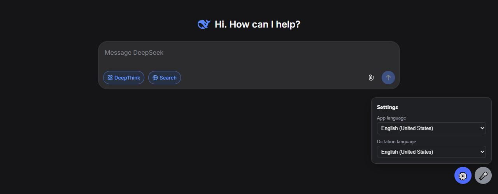

<div align="center">


# DeepSeek for Windows<sup>*</sup>

**Open-source DeepSeek app for Windows 10 and 11.**<br>
Its own window, a Desktop shortcut and a taskbar icon. Everything lives in one folder.

[](../../releases/latest)
[](../../releases)
[](#requirements)
[](LICENSE)

<a href="../../releases/latest"></a>

**English** · [Русский](README.ru.md) · [Website](https://ishimuraxxx-ai.github.io/deepseek-1.0.1/)



</div>

## Install

1. Download **`DeepSeek-portable.zip`** from [Releases](../../releases/latest).
2. Unzip it to a permanent place, for example `C:\DeepSeek`.
3. Run **`DeepSeek.exe`**. A **DeepSeek** shortcut appears next to it: just drag it to your Desktop.

Then sign in to your DeepSeek account. That's it.

> [!TIP]
> If Windows says **"Windows protected your PC"**, click **More info → Run anyway**. The exe isn't signed with a paid certificate. You can [verify it](#transparency) or [build it yourself](#build-from-source).

## Features

| | |
|---|---|
| 🖥️ **Its own window** | No browser tabs or address bar. DeepSeek opens like any Windows program, with its own taskbar icon. |
| 📁 **One portable folder** | The app, settings and your login live in one folder. Your regular browser isn't touched. |
| 🌐 **88 interface languages** | Switch DeepSeek's interface language from the ⚙️ settings panel. |
| 🎤 **Voice input (optional)** | Dictate with the 🎤 button or **Ctrl+Space** in 50+ languages. Say **"send"** to send. |
| 🔍 **Transparent builds** | The exe is built by GitHub Actions from this code, with checksums and a provenance attestation. |

## Requirements

- Windows 10 or 11
- Microsoft Edge (preinstalled on Windows)
- A free DeepSeek account

## Why this project

DeepSeek has no official Windows app. The Microsoft Store listing named DeepSeek is only available in the China region, and it's the Android app, which needs the Windows Subsystem for Android that Microsoft shut down in 2025. Other "DeepSeek Desktop" projects ship prebuilt installers you can't check against their source.

This project is just the official website [chat.deepseek.com](https://chat.deepseek.com/), Microsoft Edge and about 70 lines of code you can read in full.

## Transparency

- **All code is open.** Launcher: [`launcher/DeepSeek.cs`](launcher/DeepSeek.cs). Extension: [`extension/voice.js`](extension/voice.js). Build script: [`build.ps1`](build.ps1).
- **GitHub builds the exe, not the author.** Releases come from [`.github/workflows/release.yml`](.github/workflows/release.yml), and every build log is public in the [Actions](../../actions) tab.
- **Verify the origin** of your `DeepSeek.exe`:
  ```
  gh attestation verify DeepSeek.exe -R ishimuraxxx-ai/deepseek-1.0.1
  ```
- **Checksums.** Every release includes `SHA256SUMS.txt`. Compare with `Get-FileHash DeepSeek.exe -Algorithm SHA256`.
- **No telemetry.** The app talks only to DeepSeek.

<details>
<summary><b>How it works</b></summary>

<br>

`DeepSeek.exe` starts Microsoft Edge in app mode with its own profile and a small extension, and keeps a `DeepSeek.lnk` shortcut next to itself:

```
msedge.exe --user-data-dir="<folder>\profile"
           --load-extension="<folder>\extension"
           --no-first-run --no-default-browser-check
           --app=https://chat.deepseek.com/
```

The separate profile makes the window its own process, so the extension loads even when your regular Edge is open.

```
DeepSeek/
├── DeepSeek.exe        ← the app
├── DeepSeek.lnk        ← shortcut, drag it to the Desktop (DeepSeek.exe creates it)
├── extension/          ← settings panel and voice input (Edge extension)
├── launcher/           ← source code of DeepSeek.exe
├── build.ps1           ← builds DeepSeek.exe from source
├── install.cmd         ← optional: Desktop and Start menu shortcuts in one click
├── uninstall.cmd       ← removes those shortcuts
└── profile/            ← your DeepSeek login (created on first run)
```

> [!WARNING]
> The `profile/` folder contains your login. Never share it. Git ignores it.

If you move the folder, run `DeepSeek.exe` from the new place: the shortcut next to it updates itself.

</details>

<details>
<summary><b>Voice input</b></summary>

<br>

| Action | How |
|---|---|
| Dictate into the message box | 🎤 button or **Ctrl+Space** |
| Send the message | say **"send"** at the end (also «отправить», «надіслати») |
| Clear the message box | say **"clear"** (also «очистить») |
| Dictation language | ⚙️ → Dictation language (50+ languages) |

Speech is recognized by Edge's built-in Web Speech API (a Microsoft cloud service), so an internet connection is needed. Allow microphone access the first time.

</details>

<details>
<summary><b>Build from source</b></summary>

<br>

1. **Code → Download ZIP** (or `git clone`) and unzip.
2. Double-click `install.cmd`. It builds `DeepSeek.exe` with the C# compiler that ships with Windows (.NET Framework 4) and creates the shortcuts.

Rebuild manually: `powershell -ExecutionPolicy Bypass -File build.ps1`

**New release (maintainer):** `git tag v1.0.2` and `git push origin v1.0.2`. GitHub Actions builds and publishes `DeepSeek.exe`, `DeepSeek-portable.zip` and `SHA256SUMS.txt`.

</details>

<details>
<summary><b>Troubleshooting</b></summary>

<br>

**The captcha fails when signing in.** Usually a VPN: DeepSeek's protection rejects data-center IP addresses. Turn the VPN off while signing in, or exclude these from it:

```
deepseek.com
fengkongcloud.com
fengkongcloud.cn
awswaf.com
```

**"Microphone access denied".** Click the lock icon left of the address and allow the microphone. Also check Windows Settings → Privacy → Microphone.

**Text isn't inserted or sent.** DeepSeek may have changed its page. Please [open an issue](../../issues/new/choose).

**The app language doesn't change.** The extension writes your choice to the site's own setting (`localStorage` key `__appKit_@deepseek/chat_localePreference`). If DeepSeek renames it, please open an issue.

</details>

<details>
<summary><b>Uninstall</b></summary>

<br>

Run `uninstall.cmd` to remove the shortcuts, then delete the folder.

</details>

## FAQ

<details>
<summary><b>Is there an official DeepSeek desktop app for Windows?</b></summary>
<br>
No (as of September 2026). DeepSeek offers the website chat.deepseek.com and mobile apps. The Microsoft Store listing is only the Android app for the China region, and it doesn't run on Windows 10. This project is an unofficial open-source alternative: the official website in its own window.
</details>

<details>
<summary><b>How do I install DeepSeek on a Windows 10 or 11 PC?</b></summary>
<br>
Download <code>DeepSeek-portable.zip</code> from Releases, unzip it and run <code>DeepSeek.exe</code>. A DeepSeek shortcut appears next to it: drag it to your Desktop.
</details>

<details>
<summary><b>Is it safe?</b></summary>
<br>
All code is open, and the exe is built publicly by GitHub Actions with checksums and a provenance attestation. The app collects no data and keeps your login only in its own folder.
</details>

<details>
<summary><b>Is it free?</b></summary>
<br>
Yes, MIT license. You need a regular free DeepSeek account.
</details>

<details>
<summary><b>Does it work on macOS or Linux?</b></summary>
<br>
No, only Windows 10/11 with Microsoft Edge.
</details>

---

<sub>* Unofficial app. Not affiliated with or endorsed by DeepSeek. · [MIT License](LICENSE)</sub>
