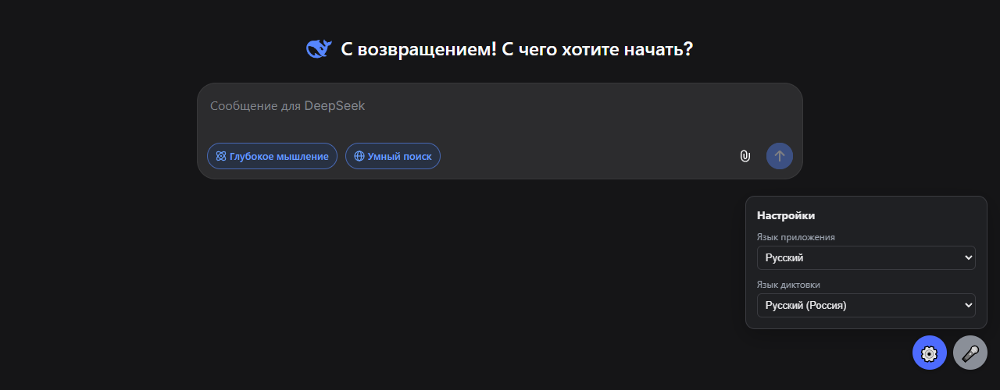

<div align="center">


# DeepSeek для Windows<sup>*</sup>

**Приложение DeepSeek с открытым кодом для Windows 10 и 11.**<br>
Своё окно, ярлык на рабочем столе и значок на панели задач. Всё в одной папке.

[](../../releases/latest)
[](../../releases)
[](#требования)
[](LICENSE)

<a href="../../releases/latest"></a>

[English](README.md) · **Русский** · [Сайт](https://ishimuraxxx-ai.github.io/deepseek-1.0.1/ru/)



</div>

## Установка

1. Скачайте **`DeepSeek-portable.zip`** из [Releases](../../releases/latest).
2. Распакуйте в постоянное место, например `C:\DeepSeek`.
3. Запустите **`DeepSeek.exe`**. Рядом появится ярлык **DeepSeek**: просто перетащите его на рабочий стол.

Затем войдите в аккаунт DeepSeek. Готово.

> [!TIP]
> Если Windows пишет **«Система Windows защитила ваш компьютер»**, нажмите **«Подробнее» → «Выполнить в любом случае»**. exe не подписан платным сертификатом. Его можно [проверить](#прозрачность) или [собрать самим](#сборка-из-исходников).

## Возможности

| | |
|---|---|
| 🖥️ **Своё окно** | Без вкладок и адресной строки. DeepSeek открывается как обычная программа Windows, со своим значком на панели задач. |
| 📁 **Всё в одной папке** | Приложение, настройки и вход в аккаунт лежат в одной папке. Ваш обычный браузер не затрагивается. |
| 🌐 **88 языков интерфейса** | Язык интерфейса DeepSeek переключается из панели настроек ⚙️. |
| 🎤 **Голосовой ввод (по желанию)** | Диктовка кнопкой 🎤 или **Ctrl+Пробел** на 50+ языках. «Отправить» — отправляет сообщение. |
| 🔍 **Прозрачная сборка** | exe собирает GitHub Actions из этого кода, с контрольными суммами и аттестацией происхождения. |

## Требования

- Windows 10 или 11
- Microsoft Edge (уже есть в Windows)
- Бесплатный аккаунт DeepSeek

## Зачем этот проект

Официального приложения DeepSeek для Windows нет. В Microsoft Store под этим именем — только Android-приложение для региона «Китай», которому нужна подсистема Windows для Android, а её Microsoft закрыла в 2025 году. Другие «DeepSeek Desktop» на GitHub раздают готовые установщики, которые нельзя сверить с исходным кодом.

Этот проект — просто официальный сайт [chat.deepseek.com](https://chat.deepseek.com/), Microsoft Edge и около 70 строк кода, которые можно прочитать целиком.

## Прозрачность

- **Весь код открыт.** Запускающий файл: [`launcher/DeepSeek.cs`](launcher/DeepSeek.cs). Расширение: [`extension/voice.js`](extension/voice.js). Сборка: [`build.ps1`](build.ps1).
- **exe собирает GitHub, а не автор.** Релизы делает [`.github/workflows/release.yml`](.github/workflows/release.yml), лог каждой сборки открыт во вкладке [Actions](../../actions).
- **Проверить происхождение** вашего `DeepSeek.exe`:
  ```
  gh attestation verify DeepSeek.exe -R ishimuraxxx-ai/deepseek-1.0.1
  ```
- **Контрольные суммы.** В каждом релизе есть `SHA256SUMS.txt`. Сравнить: `Get-FileHash DeepSeek.exe -Algorithm SHA256`.
- **Никакой телеметрии.** Приложение обращается только к DeepSeek.

<details>
<summary><b>Как это устроено</b></summary>

<br>

`DeepSeek.exe` запускает Microsoft Edge в режиме приложения со своим профилем и небольшим расширением, и держит рядом с собой ярлык `DeepSeek.lnk`:

```
msedge.exe --user-data-dir="<папка>\profile"
           --load-extension="<папка>\extension"
           --no-first-run --no-default-browser-check
           --app=https://chat.deepseek.com/
```

Отдельный профиль делает окно своим процессом, поэтому расширение подключается, даже когда обычный Edge уже открыт.

```
DeepSeek/
├── DeepSeek.exe        ← само приложение
├── DeepSeek.lnk        ← ярлык, перетащите на рабочий стол (создаёт DeepSeek.exe)
├── extension/          ← панель настроек и голосовой ввод (расширение Edge)
├── launcher/           ← исходник DeepSeek.exe
├── build.ps1           ← сборка DeepSeek.exe из исходника
├── install.cmd         ← по желанию: ярлыки на рабочем столе и в «Пуске» одним щелчком
├── uninstall.cmd       ← убрать эти ярлыки
└── profile/            ← ваш вход в аккаунт DeepSeek (создаётся при первом запуске)
```

> [!WARNING]
> Папка `profile/` содержит ваш вход в аккаунт. Не отправляйте её никому. Git её игнорирует.

Если перенесли папку, запустите `DeepSeek.exe` на новом месте: ярлык рядом с ним обновится сам.

</details>

<details>
<summary><b>Голосовой ввод</b></summary>

<br>

| Действие | Как |
|---|---|
| Диктовка в поле ввода | кнопка 🎤 или **Ctrl+Пробел** |
| Отправить сообщение | сказать в конце **«отправить»** (также «send», «надіслати») |
| Очистить поле | сказать **«очистить»** (также «clear») |
| Язык диктовки | ⚙️ → Язык диктовки (50+ языков) |

Речь распознаёт встроенный в Edge Web Speech API (облачный сервис Microsoft), поэтому нужен интернет. Разрешите доступ к микрофону при первом включении.

</details>

<details>
<summary><b>Сборка из исходников</b></summary>

<br>

1. **Code → Download ZIP** (или `git clone`), распакуйте.
2. Дважды щёлкните `install.cmd`. Он соберёт `DeepSeek.exe` компилятором C#, встроенным в Windows (.NET Framework 4), и создаст ярлыки.

Пересобрать вручную: `powershell -ExecutionPolicy Bypass -File build.ps1`

**Новый релиз (для автора):** `git tag v1.0.2` и `git push origin v1.0.2`. GitHub Actions соберёт и опубликует `DeepSeek.exe`, `DeepSeek-portable.zip` и `SHA256SUMS.txt`.

</details>

<details>
<summary><b>Решение проблем</b></summary>

<br>

**Не проходит капча при входе.** Обычно из-за VPN: защита DeepSeek не пропускает адреса дата-центров. Выключите VPN на время входа или добавьте в исключения:

```
deepseek.com
fengkongcloud.com
fengkongcloud.cn
awswaf.com
```

**«Нет доступа к микрофону».** Нажмите на значок замка слева от адреса и разрешите микрофон. Проверьте также «Параметры Windows → Конфиденциальность → Микрофон».

**Текст не вставляется или не отправляется.** Возможно, DeepSeek изменил вёрстку страницы. Пожалуйста, [создайте issue](../../issues/new/choose).

**Язык приложения не меняется.** Расширение записывает выбор в настройку самого сайта (`localStorage`, ключ `__appKit_@deepseek/chat_localePreference`). Если DeepSeek переименует его, создайте issue.

</details>

<details>
<summary><b>Удаление</b></summary>

<br>

Запустите `uninstall.cmd`, чтобы убрать ярлыки, затем удалите папку.

</details>

## Частые вопросы

<details>
<summary><b>Есть ли официальное приложение DeepSeek для Windows?</b></summary>
<br>
Нет (на сентябрь 2026). У DeepSeek есть сайт chat.deepseek.com и мобильные приложения. В Microsoft Store под этим именем — только Android-приложение для региона «Китай», на Windows 10 оно не работает. Этот проект — неофициальная открытая альтернатива: официальный сайт в отдельном окне.
</details>

<details>
<summary><b>Как установить DeepSeek на компьютер с Windows 10 или 11?</b></summary>
<br>
Скачайте <code>DeepSeek-portable.zip</code> из Releases, распакуйте и запустите <code>DeepSeek.exe</code>. Рядом появится ярлык DeepSeek: перетащите его на рабочий стол.
</details>

<details>
<summary><b>Это безопасно?</b></summary>
<br>
Весь код открыт, exe собирается публично на GitHub Actions с контрольными суммами и аттестацией происхождения. Приложение не собирает данные и хранит вход в аккаунт только в своей папке.
</details>

<details>
<summary><b>Это бесплатно?</b></summary>
<br>
Да, лицензия MIT. Нужен обычный бесплатный аккаунт DeepSeek.
</details>

<details>
<summary><b>Работает ли на macOS или Linux?</b></summary>
<br>
Нет, только Windows 10/11 с Microsoft Edge.
</details>

---

<sub>* Неофициальное приложение. Не связано с компанией DeepSeek. · [Лицензия MIT](LICENSE)</sub>
